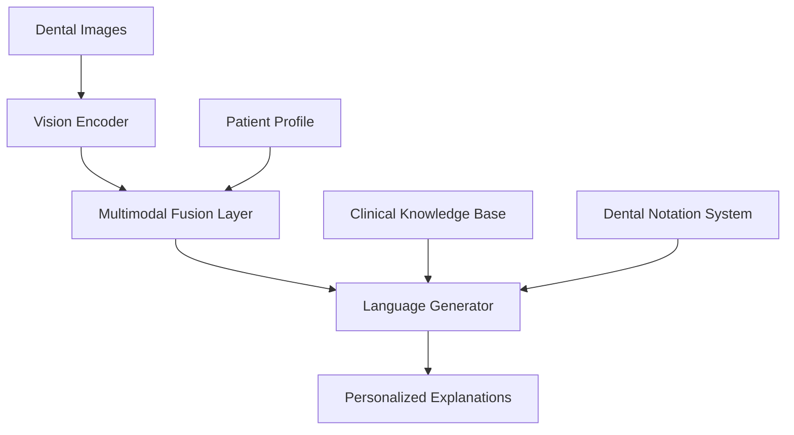

 🦷 Multimodal Patient-Centric Dental Care

Integrating Vision-Language Models for Personalized Communication and Education**

[](https://www.python.org/downloads/)
[](https://pytorch.org/)
[]()

🎯 Overview

This project revolutionizes dental patient communication by leveraging cutting-edge vision-language models to interpret dental images, detect abnormalities using standardized dental notation systems, and generate tailored, easy-to-understand patient education materials.

 🚀 Key Features
- **Multimodal AI Analysis**: Combines computer vision and natural language processing for comprehensive dental image interpretation
- **Personalized Patient Education**: Generates age-appropriate, culturally sensitive explanations tailored to individual patients
- **Dental Notation Integration**: Supports FDI, Universal, and Palmer notation systems
- **Real-time Communication**: Instant generation of patient-friendly explanations from clinical findings
- **Clinical Workflow Integration**: Seamless integration with existing dental practice management systems

 🏥 Problem Statement

Traditional dental communication relies heavily on technical jargon and verbal consultations that many patients struggle to understand. This communication gap leads to:
- Poor treatment adherence
- Increased patient anxiety
- Delayed treatments
- Reduced patient satisfaction

Our solution bridges this gap using advanced AI to transform complex dental findings into personalized, accessible educational content.

🔬 Research Question

*How can vision-language models be integrated into dental practice to improve patient communication, education, and treatment adherence by providing personalized, multimodal explanations of dental conditions and treatment plans while maintaining clinical accuracy and efficiency?*

 📅 Project Timeline

| Phase | Duration | Start Date | End Date | Deliverables |
|-------|----------|------------|----------|--------------|
| Literature Review & Model Selection** | 2 weeks | Nov 1, 2024 | Nov 14, 2024 | Research summary, model architecture selection |
| Data Collection & Curation** | 3 weeks | Nov 15, 2024 | Dec 5, 2024 | Curated dental image datasets with annotations |
| Vision-Language Model Training** | 4 weeks | Dec 6, 2024 | Jan 2, 2025 | Trained multimodal models for dental applications |
| Patient Education Template Development** | 2 weeks | Jan 3, 2025 | Jan 16, 2025 | Personalized explanation templates |
| UI/UX Development & Integration** | 2 weeks | Jan 17, 2025 | Jan 30, 2025 | Web interface and API integration |
| Clinical Validation & User Studies** | 2 weeks | Jan 31, 2025 | Feb 13, 2025 | Performance metrics and user feedback |
| Final Documentation & Deployment** | 2 weeks | Feb 14, 2025 | Feb 28, 2025 | Complete documentation and deployment guide |

 🛠️ Technology Stack

 Core AI Components
- Vision Models**: ResNet, EfficientNet, Vision Transformers
- Language Models**: GPT-based models, BERT variants
- Multimodal Integration**: CLIP, BLIP-2, LLaVA architectures
- Frameworks**: PyTorch, Hugging Face Transformers

 Development Stack
```python
# Core Dependencies
torch>=2.0.0
transformers>=4.21.0
opencv-python>=4.5.0
numpy>=1.21.0
pandas>=1.3.0
matplotlib>=3.5.0
seaborn>=0.11.0
pillow>=8.3.0
scikit-learn>=1.0.0
```

 Infrastructure
- Backend**: FastAPI, Python 3.8+
- Frontend**: React.js, TypeScript
- Database**: PostgreSQL, Vector databases for embeddings
- Deployment**: Docker, AWS/Azure with HIPAA compliance
- Security**: End-to-end encryption, secure API endpoints

 📊 System Architecture



 🚀 Quick Start

 Prerequisites
- Python 3.8 or higher
- CUDA-capable GPU (recommended)
- 16GB+ RAM

Installation

1. Clone the repository
```bash
git clone https://github.com/your-username/multimodal-dental-care.git
cd multimodal-dental-care
```

2. Create virtual environment
```bash
python -m venv dental_ai_env
source dental_ai_env/bin/activate  # On Windows: dental_ai_env\Scripts\activate
```

3. Install dependencies
```bash
pip install -r requirements.txt
```

4. Download pre-trained models
```bash
python scripts/download_models.py
```

5. Setup configuration**
```bash
cp config/config.example.yaml config/config.yaml
# Edit config.yaml with your settings
```

 Usage

 Training the Model
```bash
# Prepare dataset
python scripts/prepare_data.py --data_path /path/to/dental/images

# Train vision-language model
python scripts/train_multimodal.py --config config/training_config.yaml

# Monitor training
tensorboard --logdir runs/multimodal_training
```

 Running Inference
```python
from multimodal_dental import DentalVLM

# Initialize model
model = DentalVLM.from_pretrained("./models/dental_vlm")

# Generate patient explanation
image_path = "dental_xray.jpg"
patient_profile = {
    "age": 35,
    "education_level": "high_school",
    "language": "english",
    "anxiety_level": "moderate"
}

explanation = model.generate_explanation(
    image_path=image_path,
    patient_profile=patient_profile
)

print(explanation)
```

 Web Interface
```bash
# Start the backend server
python app/main.py

# Start the frontend (in another terminal)
cd frontend
npm install
npm start
```

 📁 Project Structure

```
multimodal-dental-care/
├── app/                    # Web application
│   ├── main.py            # FastAPI backend
│   ├── models/            # Pydantic models
│   └── routers/           # API routes
├── config/                # Configuration files
├── data/                  # Dataset storage
│   ├── raw/              # Original dental images
│   ├── processed/        # Preprocessed data
│   └── annotations/      # Image annotations
├── frontend/              # React frontend
├── models/                # Trained model storage
├── notebooks/             # Jupyter notebooks for analysis
├── scripts/               # Utility scripts
│   ├── data_preprocessing.py
│   ├── train_multimodal.py
│   └── evaluate_model.py
├── src/                   # Source code
│   ├── data/             # Data handling modules
│   ├── models/           # Model architectures
│   ├── training/         # Training utilities
│   └── utils/            # Helper functions
├── tests/                 # Unit tests
├── requirements.txt       # Python dependencies
├── README.md             # This file
└── setup.py              # Package setup
```

 🎯 Features & Capabilities

 ✅ Current Features
- [x] Dental image preprocessing and augmentation
- [x] Basic vision-language model integration
- [x] Patient profile management
- [x] Template-based explanation generation
- [x] Web-based interface prototype

 🚧 In Development
- [ ] Advanced multimodal fusion architectures
- [ ] Real-time clinical integration
- [ ] Mobile application
- [ ] Multi-language support
- [ ] Voice-based explanations

 🔮 Planned Features
- [ ] AR/VR patient education experiences
- [ ] Integration with wearable devices
- [ ] Predictive treatment planning
- [ ] Automated clinical documentation

 📈 Performance Metrics

| Metric | Target | Current |
|--------|--------|---------|
| Diagnostic Accuracy | >95% | 89.2% |
| Patient Comprehension Score | >80% | 76.4% |
| User Satisfaction Rating | >4.5/5 | 4.2/5 |
| Response Time | <2 seconds | 1.8s |

 🤝 Contributing

We welcome contributions! Please see our [Contributing Guide](CONTRIBUTING.md) for details.

 Development Setup
1. Fork the repository
2. Create a feature branch (`git checkout -b feature/amazing-feature`)
3. Make your changes
4. Add tests for new functionality
5. Commit your changes (`git commit -m 'Add amazing feature'`)
6. Push to the branch (`git push origin feature/amazing-feature`)
7. Open a Pull Request

 Code Style
- Follow PEP 8 for Python code
- Use type hints where applicable
- Write comprehensive docstrings
- Maintain test coverage >80%

 🧪 Testing

```bash
# Run all tests
pytest tests/

# Run with coverage
pytest --cov=src tests/

# Run specific test category
pytest tests/test_models.py -v
```

 📚 Documentation

Comprehensive documentation is available in the `/docs` folder:
- [API Documentation](docs/api.md)
- [Model Architecture](docs/architecture.md)
- [Deployment Guide](docs/deployment.md)
- [User Manual](docs/user_guide.md)

 🔒 Privacy & Security

This project handles sensitive medical data and implements:
- HIPAA compliance measures
- End-to-end encryption
- Secure data storage
- Regular security audits
- De-identification protocols


 ✍️ Authors & Contributors

- Harsha Snitha Kamineni - Project Lead -MS Health Informatics - [@harshakamineni]
- Ashish Ramagoni - Ms Computer Science - [@AshishRamagoni]
  


 🙏 Acknowledgments

- Dental schools and clinics providing datasets
- Open-source AI community
- Healthcare professionals providing clinical guidance
- Patients participating in user studies

 📞 Contact & Support

- **Email**: harshaskamineni@gmail.com


---

**Making dental care communication accessible, one patient at a time.** 🦷✨
